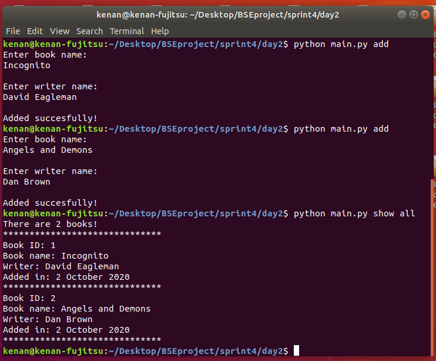
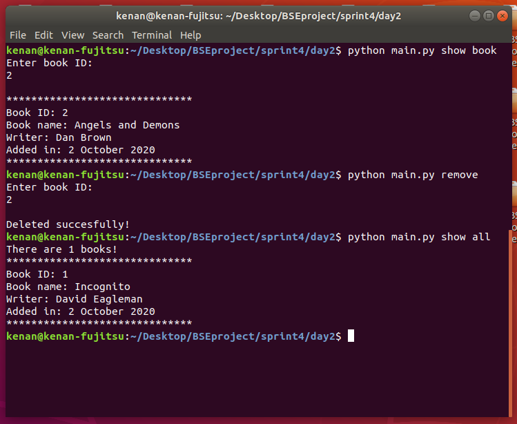
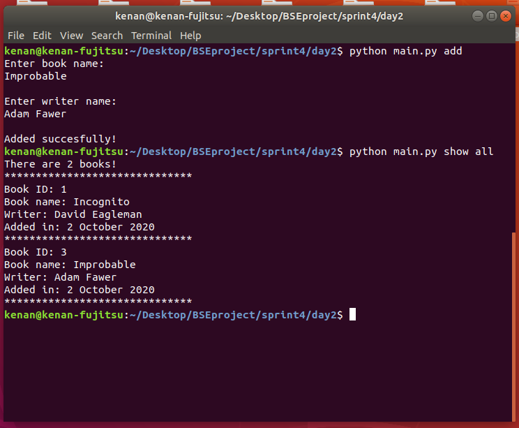

## Console App about Books

### 3.day tasks

* On day 3, the same application as on day 2 must be written. But OOP should be used.
* You must have a Book class.
* The Book class must have a title, author, id, and date variables.
* The Book class must have set_id, set_date, show_all, show_book, add_book, remove_book methods.
* Each time a command is executed, an object must be created or appropriate methods must be executed.

### Console pictures

